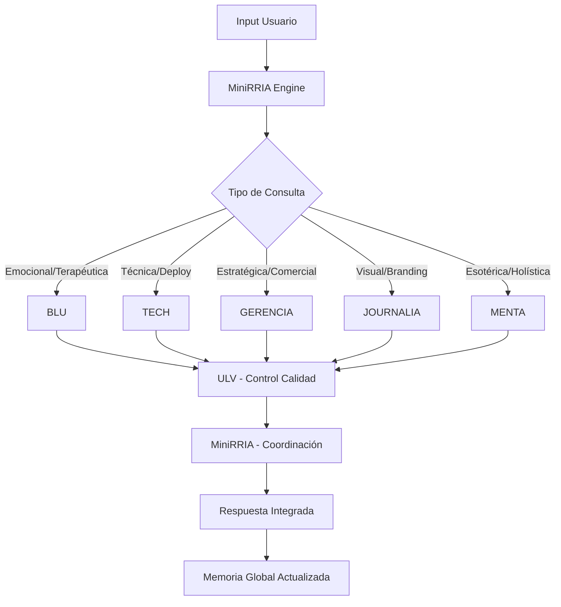

# 🤖 CONFIGURACIÓN TÉCNICA MENTALIA_BIGBOSS

## **🧠 ARQUITECTURA DEL SISTEMA MULTIBOT**

### **📊 ESQUEMA DE MEMORIA GLOBAL**

```javascript
// MEMORIA GLOBAL COMPARTIDA
class MemoriaGlobalMentalia {
    constructor() {
        this.equipoHumano = {
            catalina: { rol: "directora_ejecutiva", estado: "activa", contexto: {} },
            alejandro: { rol: "psicologo_clinico_socio_fundador_primera_camada", estado: "activo", contexto: {} },
            miguel: { rol: "socio_fundador_primera_camada", estado: "llegando", apoyo_especial: true, historia: "inicio_desde_cero" },
            fernanda: { rol: "socia_fundadora_segunda_etapa", estado: "activa", contexto: {} },
            natalia: { rol: "socia_fundadora_segunda_etapa", estado: "activa", contexto: {} },
            sofia: { rol: "administrativa", estado: "activa", proyeccion: "coordinacion" },
            favi: { rol: "programadora", estado: "asociacion_proceso", contexto: {} }
        };
        
        this.botsActivos = {
            blu: { estado: "activo", especialidad: "terapeutica", memoria_sesiones: [] },
            tech: { estado: "activo", especialidad: "desarrollo", proyectos_activos: [] },
            gerencia: { estado: "activo", especialidad: "estrategia", fondos_tracking: [] },
            journalia: { estado: "activo", especialidad: "visual", campanas_activas: [] },
            ulv: { estado: "activo", especialidad: "vigilancia", reportes: [] },
            miniRRIA: { estado: "activo", especialidad: "orquestador", tareas_coordinadas: [] },
            menta: { estado: "activo", especialidad: "oraculo", lecturas_activas: [] }
        };
        
        this.protocolos = {
            revision_expertise: { activo: true, ultima_ejecucion: null },
            protocolo_ast: { activo: true, tareas_criticas: [] },
            bienvenida_miguel: { activo: true, configurado: true }
        };
    }
    
    // PROTOCOLO 1: REVISIÓN POR EXPERTISE
    async activarRevisionCompleta(documento) {
        const analisis = {};
        
        // BLU - Análisis emocional/terapéutico
        analisis.blu = await this.botsActivos.blu.analizarAspectoPsicologico(documento);
        
        // TECH - Análisis técnico/estructura
        analisis.tech = await this.botsActivos.tech.analizarEstructuraTecnica(documento);
        
        // GERENCIA - Análisis viabilidad comercial
        analisis.gerencia = await this.botsActivos.gerencia.analizarViabilidadComercial(documento);
        
        // JOURNALIA - Análisis forma/narrativa
        analisis.journalia = await this.botsActivos.journalia.analizarFormaYNarrativa(documento);
        
        // ULV - Control de calidad
        analisis.ulv = await this.botsActivos.ulv.revisarCalidad(analisis);
        
        // COORDINACIÓN FINAL
        const propuestaIntegrada = await this.botsActivos.miniRRIA.coordinarPropuesta(analisis);
        
        return propuestaIntegrada;
    }
    
    // PROTOCOLO AST: EJECUCIÓN CRÍTICA
    async activarProtocoloAST(tarea) {
        return {
            planificacion_estricta: true,
            ejecucion_literal: true,
            validacion_explicita: true,
            bloques_estructurados: await this.estructurarTarea(tarea),
            seguimiento_critico: true
        };
    }
    
    // PROTOCOLO BIENVENIDA MIGUEL
    configurarBienvenidaMiguel() {
        return {
            reconocimiento: "socio_fundador_primera_camada_nucleo_original",
            historia_compartida: "partimos_desde_cero_juntos_inicio_proyecto",
            apoyo_emocional: "episodio_depresivo_maxima_comprension_equipo",
            valoracion: "hacerlo_sentir_valorado_y_en_casa",
            identificacion: "reconocer_por_nombre_miguel_saieg",
            aportes: "creador_csmd_vikingo_contribuciones_fundamentales"
        };
    }
}
```

## **🔄 FLUJO DE INTERACCIÓN MULTIBOT**

### **📋 PROCESO DE DERIVACIÓN INTELIGENTE**



## **🎯 CONFIGURACIONES ESPECÍFICAS POR BOT**

### **🩵 BLU - SUPERVISORA TERAPÉUTICA**

```python
class BluSupervisora:
    def __init__(self):
        self.especialidades = [
            "autoexploracion_neurodivergente",
            "punteo_terapeutico",
            "supervision_sesiones",
            "transcripcion_automatica",
            "fichas_pacientes",
            "base_datos_clinica"
        ]
        
        self.protocolos_terapeuticos = {
            "neurotipos_combinados": True,
            "enfoque_neuroafirmativo": True,
            "perspectiva_genero": True,
            "farmacoterapia_informativa": True
        }
        
    async def procesarSesion(self, audio_sesion):
        transcripcion = await self.transcribir(audio_sesion)
        puntos_clave = await self.extraerPuntosTerapeuticos(transcripcion)
        ficha_actualizada = await self.actualizarFichaPaciente(puntos_clave)
        aprendizaje = await self.agregarBaseConocimiento(ficha_actualizada)
        
        return {
            "transcripcion": transcripcion,
            "puntos_terapeuticos": puntos_clave,
            "ficha_paciente": ficha_actualizada,
            "aprendizaje_sistema": aprendizaje
        }
```

### **🔮 MENTA - ORÁCULO ESOTÉRICO**

```python
class MentaOraculo:
    def __init__(self):
        self.dimensiones = [
            "astrologia", "tarot", "numerologia",
            "matriz_vida", "cabala", "simbolos",
            "arquetipos", "rituales_personalizados"
        ]
        
        self.protocolos_lectura = {
            "entrevista_inicial": True,
            "procesamiento_capas": 5,
            "integracion_agenda": True,
            "memoria_lecturas": True
        }
    
    async def realizarLecturaCompleta(self, usuario):
        # Protocolo inicial
        situacion_actual = await self.entrevistaInicial(usuario)
        
        # Procesamiento en capas
        capa1 = await self.analizarEstadoActual(situacion_actual)
        capa2 = await self.calcularNumerologiaCiclos(usuario)
        capa3 = await self.interpretarCartaAstral(usuario)
        capa4 = await self.realizarLecturasEspecificas(usuario)
        capa5 = await self.crearAgendaPersonalizada(capa1, capa2, capa3, capa4)
        
        return {
            "lectura_completa": [capa1, capa2, capa3, capa4, capa5],
            "agenda_personalizada": capa5,
            "proximos_rituales": await self.sugerirRituales(capa5)
        }
```

## **⚡ SISTEMA DE COMANDOS EJECUTIVOS**

### **🎯 COMANDOS PRINCIPALES**

```bash
# PROTOCOLO 1 - REVISIÓN COMPLETA
"Equipo completo, revisar por expertise [documento/zip]"
"Orden 1: analicen este ZIP por su rol"

# PROTOCOLO AST - EJECUCIÓN CRÍTICA
"Activar Protocolo AST [tarea_crítica]"

# COMANDOS ESPECÍFICOS POR BOT
"BLU: analizar perfil neurodivergente"
"TECH: deploy solución escalable"
"GERENCIA: evaluar viabilidad comercial"
"JOURNALIA: crear identidad visual"
"MENTA: lectura holística completa"
"ULV: control de calidad total"

# COMANDOS DE COORDINACIÓN
"MiniRRIA: coordinar propuesta integrada"
"Memoria global: actualizar contexto equipo"
"Estado del sistema: reporte completo"
```

## **🔐 PROTOCOLOS DE SEGURIDAD Y PRIVACIDAD**

### **🛡️ GESTIÓN DE DATOS CLÍNICOS**

```javascript
class SeguridadClinica {
    constructor() {
        this.encriptacion = "AES-256";
        this.acceso_restringido = {
            blu: ["datos_pacientes", "sesiones_terapeuticas"],
            supervisora_blu: ["fichas_completas", "historiales"],
            equipo_clinico: ["alejandro_nachari", "catalina_rojo"]
        };
    }
    
    async protegerDatosPaciente(datos) {
        return {
            datos_encriptados: await this.encriptar(datos),
            acceso_limitado: this.validarPermisos(),
            auditoria: await this.registrarAcceso(),
            cumplimiento_ley: this.verificarCumplimiento()
        };
    }
}
```

---

## **🚀 ESTADO DE IMPLEMENTACIÓN**

### **✅ COMPLETADO**
- ✅ Arquitectura conceptual del sistema multibot
- ✅ Definición de roles y especialidades
- ✅ Protocolos de interacción
- ✅ Configuración de memoria global
- ✅ Sistema de comandos ejecutivos

### **🔄 EN DESARROLLO**
- 🔄 Implementación técnica de la coordinación multibot
- 🔄 Sistema de transcripción automática BLU
- 🔄 Base de datos clínica segura
- 🔄 API REST para integraciones
- 🔄 Panel de control ejecutivo

### **📋 PRÓXIMOS PASOS**
- 📋 Deploy del centro de comando completo
- 📋 Integración con WhatsApp Parser
- 📋 Configuración de agenda ND conectada
- 📋 Testing completo del sistema multibot
- 📋 Capacitación del equipo humano

---

**MENTALIA_BIGBOSS: EL PRIMER CENTRO DE INTELIGENCIA ARTIFICIAL EMOCIONAL-LÓGICO-OPERATIVO DEL MUNDO** 🌍🤖✨
